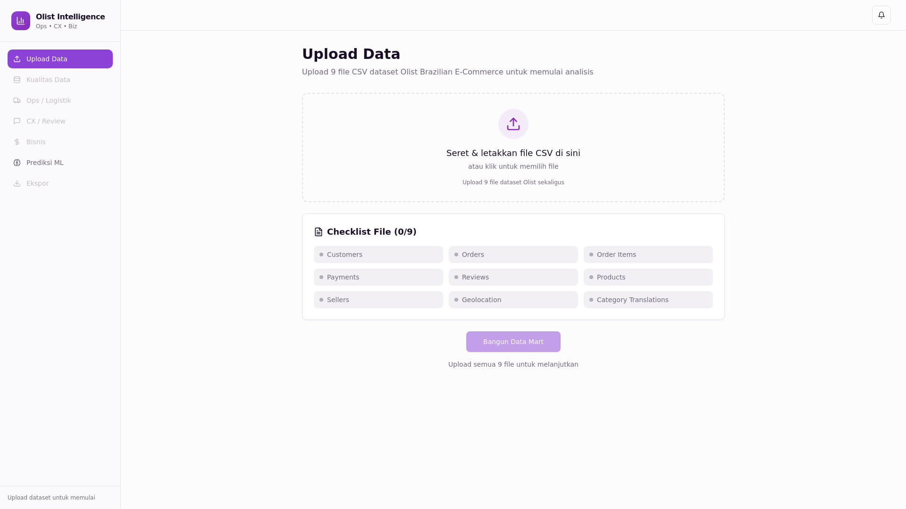
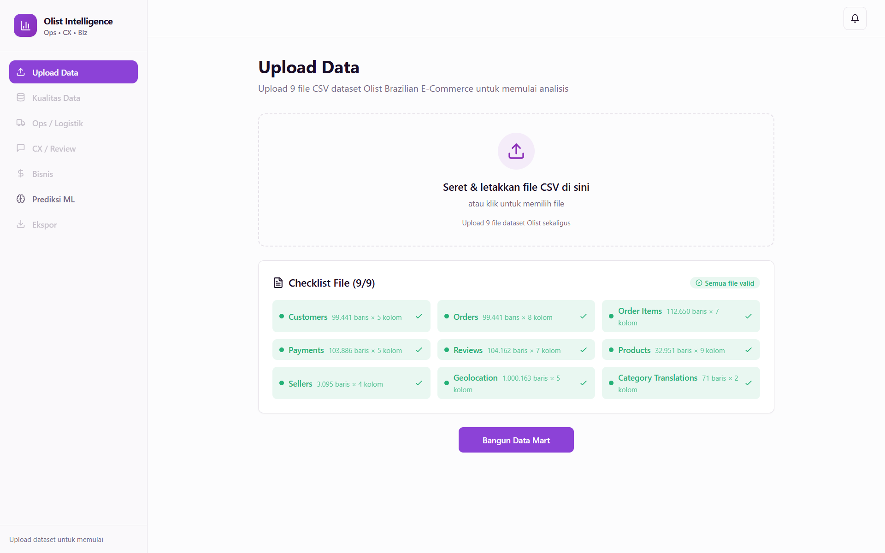
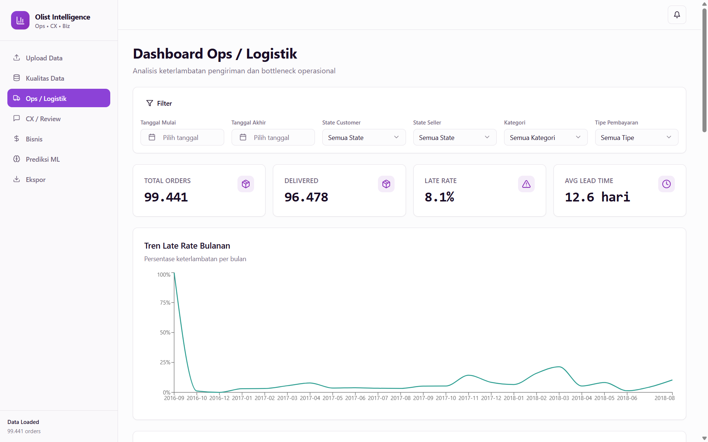
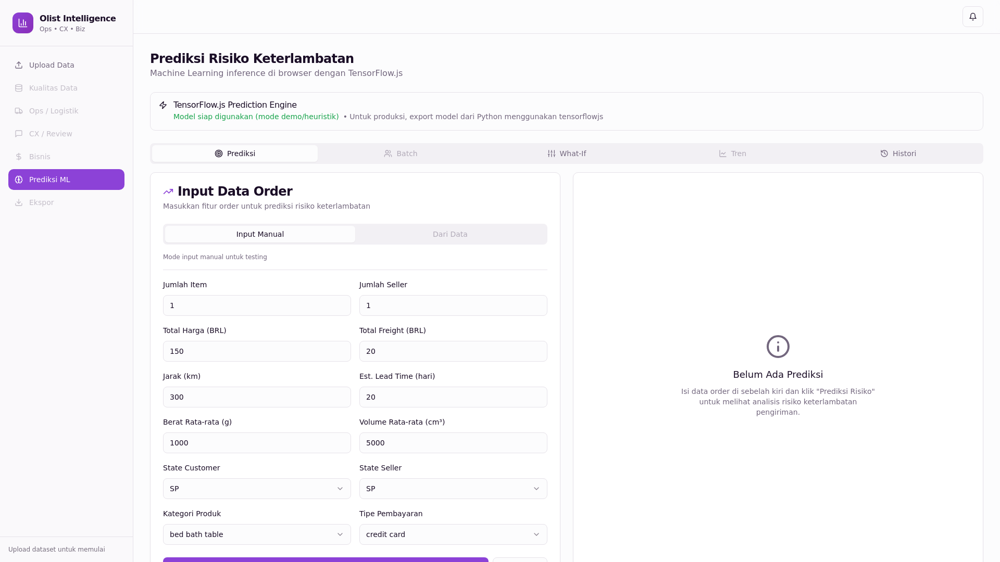
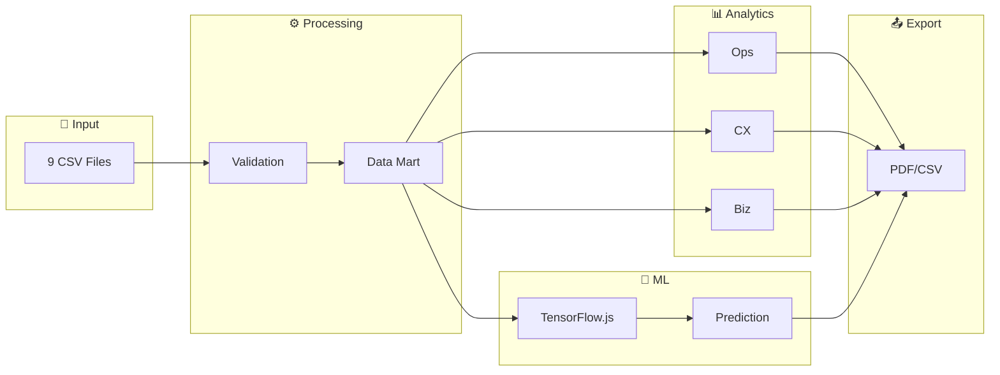

<div align="center">


<p>
<strong>📦 Ops</strong> • <strong>⭐ CX</strong> • <strong>💰 Biz</strong> • <strong>🤖 ML</strong>
</p>

<!-- Tech Stack Badges -->
<p>


</p>

<!-- Status Badges -->
<p>


</p>

<br/>

> *dulu cuma bisa bikin pie chart di excel, sekarang build predictive analytics dashboard pake ML dari scratch.*  
> *no shortcut, just consistency—ini journey data science gue.*

<br/>

[📖 Documentation](#-quick-start) • [🚀 Live Demo](https://olist-intelligence.vercel.app) • [📊 Features](#-features) • [🤝 Contributing](#-contributing)

</div>

<br/>

---

<br/>

## 🖼️ App Flow

<div align="center">

| 📤 **Upload** | ✅ **Validate** | 📊 **Analyze** | 🤖 **Predict** |
|:-------------:|:---------------:|:--------------:|:--------------:|
|  |  |  |  |
| *Drag & drop 9 Olist CSV files with progress tracking* | *Automated schema validation, missing value detection & quality scoring* | *Real-time KPI monitoring, Brazil heatmap & bottleneck analysis* | *TensorFlow.js late delivery risk prediction with What-If simulator* |

<br/>

```
📁 Upload Data  ──►  ✅ Validation  ──►  📊 Dashboard  ──►  🤖 Prediction  ──►  📤 Export
     (9 CSV)        (Schema Check)      (Ops/CX/Biz)       (ML Inference)      (PDF/CSV)
```

</div>

<br/>

---

<br/>

## ✨ Features

<table>
<tr>
<td width="50%">

### 📦 Operations Dashboard
- 📈 Late delivery rate tracking
- 🗺️ Brazil map visualization
- ⚠️ Bottleneck detection by state/seller
- 📊 Shipping performance metrics

</td>
<td width="50%">

### ⭐ Customer Experience
- 💬 Review sentiment analysis
- 🔤 NLP theme extraction
- ⭐ Rating distribution charts
- 📝 Complaint pattern detection

</td>
</tr>
<tr>
<td width="50%">

### 💰 Business Intelligence
- 💵 GMV & revenue tracking
- 📈 Monthly growth trends
- 🔄 Cohort retention matrix
- 🏆 Top category analysis

</td>
<td width="50%">

### 🤖 ML Prediction
- 🧠 TensorFlow.js browser inference
- 🎛️ What-if simulator
- 📋 Batch prediction support
- 🐍 Python export guide

</td>
</tr>
</table>

<br/>

---

<br/>

## 🏗️ Architecture



<br/>

---

<br/>

## 🛠️ Tech Stack

<div align="center">

| Layer | Technology |
|:-----:|:-----------|
| ⚛️ **Frontend** | React 18, TypeScript, Vite |
| 🎨 **Styling** | Tailwind CSS, shadcn/ui |
| 📊 **Charts** | Recharts, Brazil Map SVG |
| 🤖 **ML** | TensorFlow.js (browser) |
| 📝 **NLP** | Keyword extraction, theme clustering |
| 📤 **Export** | jsPDF, CSV generation |

</div>

<br/>

---

<br/>

## 🚀 Quick Start

```bash
# 1. Clone repository
git clone <YOUR_GIT_URL>
cd olist-intelligence-suite

# 2. Install dependencies
npm install

# 3. Start development server
npm run dev
```

<div align="center">

🌐 Open `http://localhost:5173` and upload Olist dataset

</div>

<br/>

---

<br/>

## 📁 Dataset

Download dari [Kaggle: Brazilian E-Commerce](https://www.kaggle.com/olistbr/brazilian-ecommerce) dan upload **9 files**:

<details>
<summary>📋 <b>View required files</b></summary>

| File | Description |
|------|-------------|
| `olist_customers_dataset.csv` | Customer & location data |
| `olist_orders_dataset.csv` | Order master with timestamps |
| `olist_order_items_dataset.csv` | Item details per order |
| `olist_order_payments_dataset.csv` | Payment methods & amounts |
| `olist_order_reviews_dataset.csv` | Review scores & comments |
| `olist_products_dataset.csv` | Product catalog |
| `olist_sellers_dataset.csv` | Seller data & location |
| `olist_geolocation_dataset.csv` | Coordinates per zip code |
| `product_category_name_translation.csv` | Category translations |

</details>

<br/>

---

<br/>

## 🧠 ML Pipeline

<div align="center">

```
┌────────────────────────────────────────────────────────────────┐
│  ⚠️  ANTI DATA LEAKAGE: Time-Based Split                      │
├────────────────────────────────────────────────────────────────┤
│                                                                │
│   TRAIN (< 2018-04-01)          TEST (≥ 2018-04-01)           │
│   ════════════════════          ═══════════════════           │
│   Historical orders     │       Future orders                 │
│   ✓ No future info      │       ✓ Realistic eval              │
│                                                                │
└────────────────────────────────────────────────────────────────┘
```

</div>

<details>
<summary>🔧 <b>Features used (no leakage)</b></summary>

| Feature | Description |
|---------|-------------|
| `n_items` | Number of items in order |
| `n_sellers` | Number of different sellers |
| `total_price` | Total product price |
| `total_freight` | Total shipping cost |
| `distance_km` | Seller-customer distance |
| `est_lead_time_days` | Estimated delivery time |
| `avg_weight_g` | Average product weight |
| `avg_volume_cm3` | Average product volume |

</details>

<br/>

---

<br/>

## 📂 Structure

<details>
<summary>🗂️ <b>View project structure</b></summary>

```
src/
├── components/
│   ├── dashboard/      # KPI cards, charts, Brazil map
│   ├── layout/         # Sidebar, main layout
│   ├── prediction/     # ML components
│   ├── upload/         # File uploader
│   └── ui/             # shadcn components
├── context/
│   ├── DataContext.tsx # Global state
│   └── AlertContext.tsx
├── lib/
│   ├── analytics.ts    # KPI calculations
│   ├── dataProcessing.ts
│   ├── nlpAnalysis.ts  # Theme extraction
│   ├── pdfExport.ts
│   ├── tfPrediction.ts # TensorFlow.js
│   └── validation.ts
├── pages/
│   ├── UploadPage.tsx
│   ├── OpsPage.tsx
│   ├── CXPage.tsx
│   ├── BizPage.tsx
│   ├── PredictionPage.tsx
│   └── ExportPage.tsx
└── hooks/
```

</details>

<br/>

---

<br/>

## ⚠️ Limitations

<details>
<summary>📊 <b>Dataset constraints</b></summary>

- Data period: 2016-2018 (may not reflect current conditions)
- Olist Brazil marketplace only
- Review text in Portuguese

</details>

<details>
<summary>🤖 <b>ML model limitations</b></summary>

- Heuristic model for demo purposes
- For production: export → train in Python → import model
- TensorFlow.js has browser memory constraints

</details>

<br/>

---

<br/>

## 🤝 Contributing

```bash
# 1. Fork & clone
git clone https://github.com/YOUR_USERNAME/olist-intelligence-suite

# 2. Create branch
git checkout -b feature/amazing-feature

# 3. Commit changes
git commit -m "Add amazing feature"

# 4. Push & create PR
git push origin feature/amazing-feature
```

<br/>

---

<br/>

<div align="center">

## 📜 License

**MIT License** - Free to use for any purpose

<br/>

---

<br/>


**Made with ☕ and consistency**

*dari Excel pie chart ke predictive analytics—ini journey data science.*

<br/>

⭐ Star this repo if you find it useful!

</div>
